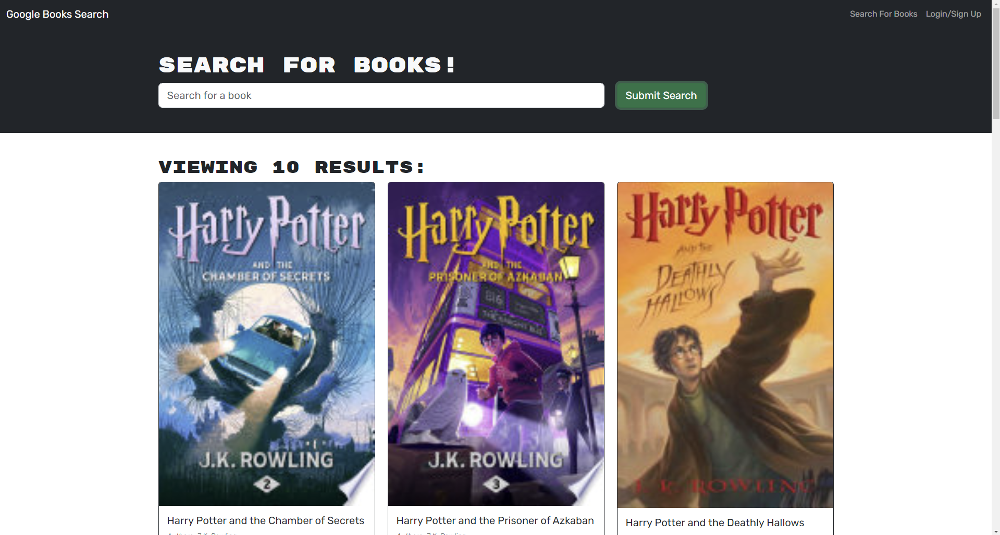

# MERN Book Finder

## Table of Contents
- [Description](#description)
- [Installation](#installation)
- [Node Packages](#node-packages)
- [License](#license)

## Description
A full-stack web application built using the MERN (MongoDB, Express.js, React, Node.js) stack. This application allows users to search for books using the Google Books API and save their favorite books to their personal profiles. Users can create an account, log in, and manage their saved books. The application features a responsive design, ensuring a seamless experience across various devices.

[](https://mikematics22800.github.io/MERN-Book-Finder)

## Installation

```bash
# Navigate to your desired directory
cd path/to/your/desired/directory
# Clone the repository
git clone https://github.com/mikematics22800/MERN-Book-Finder
# Enter the project directory
cd MERN-Book-Finder
# Install dependencies
npm install
# Start the development server
npm run develop
```
## Node Packages
React | React Router | Vite | GraphQL | Apollo

## License
[](https://opensource.org/licenses/ISC)
