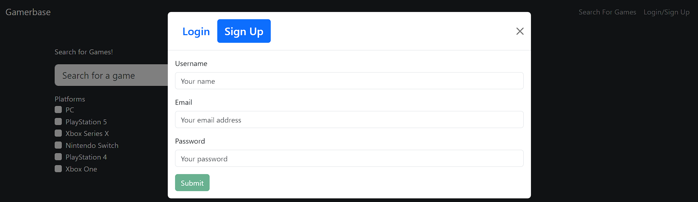
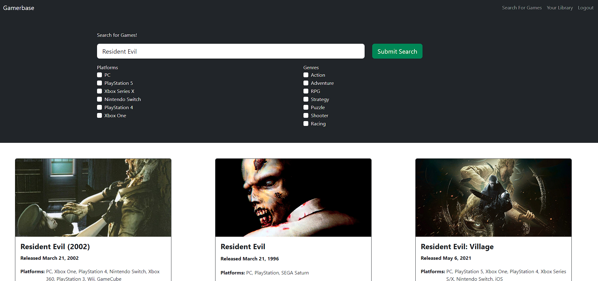

# Gamerbase

## Description

 This project uses the MERN Stack to build an reactive Video Game Database in which users can search and use search filters to add favored games to their profile. <!--they like when you add a link to the deployed site here -->

## Table of Contents

- [Installation](#installation)
- [Features](#features)
- [Visuals](#visuals)
- [Contributions](#contributions)
- [Authors](#authors)
- [License](#license)

## Installation

1. Download and install node
2. Clone the repository
3. In the terminal, go to the cloned repository location
4. Enter the following command to install all the dependencies: `npm run install`
5. Enter the following command to run the program: `npm run develop`
6. Opens in localhost 3000

## Features

This project was developed using the MERN Stack Method.
It uses Mongodb to store user data.
Uses RAWG Api to fetch game data.
Uses React to build the UI.

## Visuals

 <!-- -->

## Contributions
If you would like to contribute please fork the repo and clone it locally, then make your own branch and open a pull request.

## Authors

- [Michael Medina](https://github.com/mikematics22800)
- [David Butterworth](https://github.com/AeroRider66)
- [Daved Strzykalski](https://github.com/dstrzykalski)
- [Jean Habyiaremye](https://github.com/jahdona)
- [Rashawn Hall](https://github.com/TheR16H)

## License

MIT License

Copyright (c) 2024

Permission is hereby granted, free of charge, to any person obtaining a copy
of this software and associated documentation files (the "Software"), to deal
in the Software without restriction, including without limitation the rights
to use, copy, modify, merge, publish, distribute, sublicense, and/or sell
copies of the Software, and to permit persons to whom the Software is
furnished to do so, subject to the following conditions:

The above copyright notice and this permission notice shall be included in all
copies or substantial portions of the Software.

THE SOFTWARE IS PROVIDED "AS IS", WITHOUT WARRANTY OF ANY KIND, EXPRESS OR
IMPLIED, INCLUDING BUT NOT LIMITED TO THE WARRANTIES OF MERCHANTABILITY,
FITNESS FOR A PARTICULAR PURPOSE AND NONINFRINGEMENT. IN NO EVENT SHALL THE
AUTHORS OR COPYRIGHT HOLDERS BE LIABLE FOR ANY CLAIM, DAMAGES OR OTHER
LIABILITY, WHETHER IN AN ACTION OF CONTRACT, TORT OR OTHERWISE, ARISING FROM,
OUT OF OR IN CONNECTION WITH THE SOFTWARE OR THE USE OR OTHER DEALINGS IN THE
SOFTWARE.
